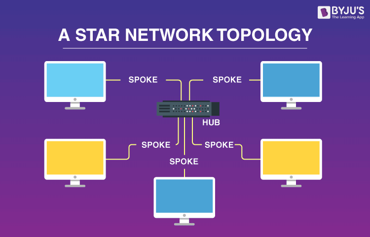
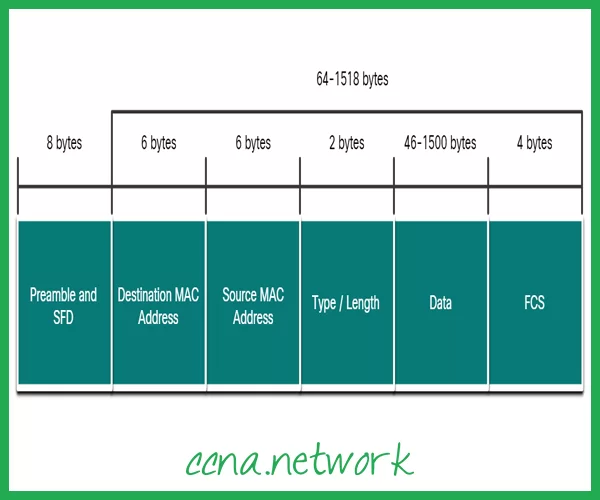

# Ethernet

- Tecnologia de LaN com fio "dominante"
- Barata e simples

## Topologia de estrela
- Computador ativo no centro
- Cada ponta roda um protocolo Ethernet separado
- Nós não colidem uns com os outros

## Estrutura do quadro Ethernet

- Não confiável (sem verificações)
- Usa CSMA/CD

## Algoritmo ethernet
1. NIC recebe datagrama da camada de rede e cria o quadro
2. Se NIC sentir canal ocioso, inicia transmissão do quadro. Se não, espera ficar ocioso
3. Se NIC transmitir o quadro inteiro sem detectar outra transmissão, NIC terminou com o quadro
4. Se NIC determinar outra transmissão enquanto transmite, aborta e envia sinal de congestionamento
5. Depois de abortar, NIC entra em **backoffice exponencial**
    - Após m colisões, NIC escolhe K aleatoriamente dentre { 0, 1, 2, ..., 2^m-1 }
    - NIC espera K * 512 tempos de bit e retorna à etapa 2.

## Codificação Manchester
- Usado no 10BaseT
- Representação de bits transmitidos
- Permite que clocks nos nós emissor e receptor sejam sincronizados entre si
- Já é camada física!
